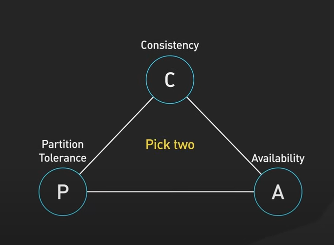

# Dunning-Kruger-Logs
A cognitive bias that causes people to overestimate their knowledge or abilities.
This page to always remind me that i know nothing about the world, so keep learning.
Well, this is my cheat sheets for an interview.

## DSA (Data Structure & Algorithm)
Here, we will try to grind using Ashish Pratap Singh module
- https://blog.algomaster.io/p/15-leetcode-patterns
- https://blog.algomaster.io/p/20-patterns-to-master-dynamic-programming
- https://www.youtube.com/watch?v=DjYZk8nrXVY

### Data Structure
- HashTable = fast lookup, map in go, dict in python, where offer O(1)
- DoublyLinkedList = fast removal, fast insertion, use more memory need to store pointer of next and prev node
- LinkedList
- Stack = LIFO last in first out
- Queue = FIFO first in first out, 

### Algorithm
- BFS - https://www.youtube.com/watch?v=6ZnyEApgFYg
- Search
    - Binary search, split array to 2 over and over again, until condition meet O(log n)
    - Tree traversal, traverse to tree node left and right O(n)
    - Linear search, loop trough array O(n)
- Sort
    - Bubble Sort
    - Quick sort O(n log n)

## Big O Notation
### Time complexity
- focus on highest growth rate rather than exact execution counts
- O(NM) + O(M) = O(NM)
- if data result from O(NM), loop through data is same as O(NM), ignore constant factor, result to O(NM)
- The dominant term in Big-O notation is the largest one.
### Space complexity
- init variable of loop O(n)
- https://www.youtube.com/watch?v=rHM3zWgnPVA

## Distributed System
### Pattern
- Ambassador, imagine busy ceo with an assistent, proxy to handle logging/monitoring/retries
    - kubernetes envoy
- CQRS, split between read and write of database
    - read to use replica
    - write to use master
- Circuit Breaker, imagine pipe breaker to prevent all mesh, if has a service down we stop the breaker to avoid other service got down
- Event Sourcing, event status update history need to be recorded
- Leader Election, if leader node failed new leader will be elected
    - apache zookeeper, 
        - distributed locking, if master who have lock failed, it will transfer the lock to other (leader election)
        - Strong consistency (ensures only one process holds the lock)
    - etcd
- Pub/Sub, publisher of a topic, and subscriber of a topic
    - updating user profile, need to update user profile on each service
- Sharding, split set of data to different node reducing load on only single node
    - mongodb
    - cassandra
- Strangle Fig, replace strangle fig tree grow around tree and completely replacing them
    - migrating from legacy system to modern gradually rather than replace all system

### Database

- https://www.youtube.com/watch?v=BHqjEjzAicA&t=1s
- https://www.youtube.com/watch?v=BTKBS_GdSms
- Ex: replica master communication
- CAP Theorem (Consistency, Availability, Partition Tolerance)
    - partition means disconnected tolerance
    - CP (Consistency + Partition Tolerance)
        - Always consistent, but may be unavailable during network failures.
        - MongoDB (single-node), HBase, Zookeeper
    - AP (Availability + Partition Tolerance)
        - Always available, but may return stale data (eventual consistency).
        - DynamoDB, Cassandra, CouchDB
    - CA (Consistency + Availability)
        - Not possible in a distributed system. 
        - A system that is both fully consistent and fully available cannot tolerate network failures. 
    - sometimes not always works, example we can allow read at 1 node but cannot write
- Connection Pooling
    - when we connect to db, we open connection after using it we close the connection
    - for connection pooling, we will keep the connection open for the other operation of operation, not immediately close it
    - this ensure, we don't frequently open and close the connection
- Eventually consistent
    - We cannot have strongly consistent database data, the database need a time to make it consistent
    - Example for pub/sub event, there will be eventually consistent data between service which publish and service which consume
- Indexing
    - need to make sure a query hit appropriate index, explain analyze
    - drawback for indexing is db need more time to write data, and update the index

### Load Balancer
- round robin, alternate between pods
- worker pool, pods will take other tasks if they finish

## Protocol
### HTTP
- http/1, http/2

## System Design
- its behavioral question, easiest if you ever had experience

## Test
- unit test
- integration test
- snapshot test
- fuzz test

## Behavioral
- rust vs golang
    - we had persistent issue with data inconsistency between our payment and a third party payment provider
    - our payment service written in go, had some legacy complexity
    - a new engineer proposed and eventually started a rewrite of the service in rust, initially as side project/poc
    - while i appricated the initiative and technical strengh of rust, i raised concern, we were tight on engineering resources
        - the team didn't have prior experience with rust, added a steep learning curve, and potential maintenance risks
    - well, despite that the project gained traction, becoming source of truth and eventually positined as our payment v2
    - over time, new features and bugs accumulated, but only that engineer could comfortably work on it
        - the team struggled to contribute
        - and onboarding others to support it proved difficult
        - then we decided to migrate the functionality back to Go to restore team wide maintainabilty
    - from this experience i learned that
        - being software engineer is not just about writing efficient code
        - its about making scalable, team aligned technical decisions
        - had we done more structured technical analysis and involved stakeholder earlier
        - we might have either committed fully to rust with a training plan
        - or avoided split in direction entirely
- if there is bugs
    1. ask a few question, so i can get more info (device, users, timestamp, ss)
        - What were the exact steps?
        - What environment or version?
        - Any logs or screenshots?
    2. try to reproduce
    3. check company wiki if any, check if similar/related issue ever exist
    4. asses impact
        - is it breaking the flow?
        - is it affect all user?
        - is it new issue?
    5. create a ticket
        - logs
        - ss
        - step to reproduce
    6. if urgent will put to current sprint, if not will doing it on next sprint
    7. deploy and test
    8. report back
- how to handle bugs in current plan
    - always adding buffer time on sprint planning

## SOLID Principle
- https://www.linkedin.com/posts/elliotone_c-solid-principles-explianed-by-elliot-one-ugcPost-7293055382741020672-Uk3C?utm_source=share&utm_medium=member_desktop&rcm=ACoAABsEHr8B2VbhRjK2xfEDzzeVePNcT92-MFM

## OOP Paradigm
- Encaptulation
    - Isolated variable within class (private, public)
- Abstraction
    - Creating abstract form, which required if any class want to implement (interface in go)
- Inheritance
    - Inherit data within parent
- Polymorphism
    - It can morp, transform, it can overwrite function from its parent (treated same if implemented in interface in go)

## LLM
Fine Tuning
- train existing model for more context accurate
- Need to provide input output, and good data
- Requires training
Prompt Engineering
- adjust ai prompt aim clear guidance for ai
RAG, Retrieval-Augmented Generation
- give ai a document knowledge
LangChain, 
- python frameworks for building RAG document index
- Building vector space by chunking the documents
Temparature
- It controls the randomness in the model's word choices.
- Lower = safer and more accurate (technical), higher = riskier and more creative (poem).
How to keep chat in context
- can pass previous chats history, or same prompt.
How to split personality
- every request should send same prompt personality guidance

## Golang
- What is the role of the select statement when used with channels in Go? To allow waiting on multiple channel operations
- An int and a bool. What is the memory usage of an instance? 9 bytes
- What does the recover() function return when called within a deferred function after a panic? Its panic value
- Slice manipulation (:)
    - slice[start:end]
    - [2:5] Give me elements from 2 to 5 (but not 5).
    - s := []int{10, 20, 30, 40, 50}
    - s[1:4]	{20, 30, 40}    From index 1 to 3 (4 not included)
    - s[:3]	    {10, 20, 30}    From index 0 to index 2
    - s[2:]     {30, 40, 50}    From index 2 to the end

## Nodejs
- eventemitter nodejs, microservices communication

## Sandbox
- TDD, Elastic APM